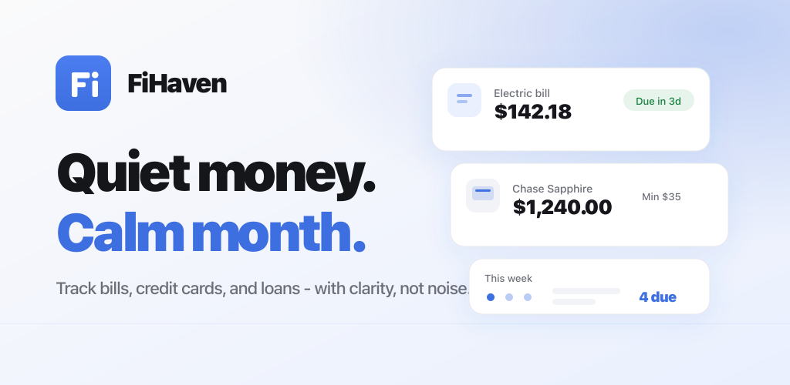

<div align="center">




# FiHaven

**Quiet money. Calm month.**

A calm, manual-first money dashboard — bills, cards, loans, budget, and
debt payoff — with full native iOS/macOS and Android apps on a shared
backend.

[](https://github.com/Greigh/FiHaven/actions/workflows/ci.yml) [](https://github.com/Greigh/FiHaven/actions/workflows/android.yml) [](https://github.com/Greigh/FiHaven/actions/workflows/ios.yml) [](https://github.com/Greigh/FiHaven/actions/workflows/codeql.yml) [](https://github.com/Greigh/FiHaven/actions/workflows/codeql-swift.yml) [](https://github.com/Greigh/FiHaven/actions/workflows/codeql-android.yml) [](https://github.com/Greigh/FiHaven/actions/workflows/dependency-review.yml) [](https://codecov.io/gh/Greigh/FiHaven)

[](https://github.com/Greigh/FiHaven/releases) [](LICENSE) [](https://nodejs.org/) [](https://swift.org) [](https://kotlinlang.org) [](https://github.com/Greigh/FiHaven/stargazers) [](https://github.com/Greigh/FiHaven/commits)

</div>

---

A focused bill and debt dashboard for people who'd rather spend five
calm minutes a week than a frantic afternoon every payday. Track
recurring bills, credit cards (including 0% promo periods), **loans**,
**income**, the **accounts you own**, a period-aware budget,
**individual transactions**, **subscriptions**, payment history,
debt-payoff strategies, and a month-grid calendar of upcoming due
dates — all behind a real account with server-side sync, optional
multi-factor sign-in (TOTP, passkeys, or email codes), an iCal feed you
can subscribe to from any calendar app, and reminders by email, push, or
on-device notification. The full inventory is in
[Features](#features).

It stays **manual-first**: you own every number. Optional **Plaid**
bank linking is just a safety net that surfaces transactions you may
have missed — it never overwrites what you entered. A **rewards
optimizer** tells you which card to reach for per spending category
(and pointedly *won't* recommend a card mid-0%-promo, since carrying a
reward purchase at the back of your payoff queue costs more in interest
than the rewards are worth). Premium features live behind a unified
**FiHaven Pro** entitlement across web (Paddle), iOS (StoreKit), and
Android (Play).

---

## Contents

| Getting started | Reference | Operations |
|---|---|---|
| [Highlights](#highlights) | [Project structure](#project-structure) | [Production deploy](#production-deploy) |
| [**Features** (the full list)](#features) | [npm scripts](#npm-scripts) | [Admin & promo codes](#admin--promo-codes) |
| [Free vs Pro](#free-vs-pro) | [Environment](#environment) | [SEO + standards](#seo--standards) |
| [Stack](#stack) | [URLs](#urls) | [Roadmap & gaps](#roadmap--gaps) |
| [Quick start](#quick-start) | [API](#api) | [License](#license) |
| [Native apps (iOS / macOS / Android)](#native-apps-ios--macos--android) | [How a few things work](#how-a-few-things-work) | |

Changelog: [CHANGELOG.md](CHANGELOG.md).

---

## Highlights

- **Bills, Cards & Loans** — recurring bills with variance sparklines,
  credit cards with 0% promo tracking, and loans/mortgages in their own
  tab (recommended payment is the minimum, not the whole balance —
  payoff-in-full stays an option).
- **Income & Balances tabs** — every paycheck with its own frequency plus
  one-off/recurring adjustments; and the accounts you *own* (checking,
  savings, investments, property, cash) in a tab of their own, feeding a
  read-only Net Worth rollup.
- **Budget suite** — period-aware budgeting (calendar, start-day, or rolling
  K-day periods), budget-rule lenses, category budgets, an envelope editor,
  and a "cushion after bills" runway.
- **Transactions & spending** — log individual spend, grouped and categorized,
  with period-over-period insights, a 12-month cash-flow chart, and
  bank-vs-manual reconciliation; optionally augmented (never replaced) by Plaid.
- **Credit-card intelligence** — a rewards optimizer with a preset database of
  popular cards, a statement-credit **perks tracker**, a card-linked **offers**
  tracker, and an annual-fee "is it worth keeping?" assessment.
- **Debt payoff** — avalanche / snowball planners with a split view.
- **Calendar + iCal** — month grid of due dates and a subscribe-anywhere feed.
- **Subscription finder** — flagged bills plus recurring-charge detection, with
  cancel links, duplicate detection, and free-trial reminders.
- **Customizable dashboard** — pick **Classic** (fixed) or **Widgets**, a
  reorderable, toggleable catalog of cards; native apps also let you rebuild the
  tab bar itself.
- **Reminders & notifications** — multiple per-bill reminder offsets, a weekly
  digest, and a monthly summary, delivered as tz-aware **email**, **push**
  (APNs / FCM / Web Push), and **local** device notifications.
- **Family sharing** — share bills, cards, and goals with up to three people,
  live-synced over SSE.
- **Sign in with Apple / Google**, passwordless **passkeys**, TOTP, and email
  codes — on web, iOS, and Android.
- **Security** — opaque server sessions, CSRF, Turnstile, per-IP rate limiting,
  AES-256-GCM at rest, step-up re-auth on sensitive actions, and a
  hardware-KeyStore-backed biometric app lock on the native apps.

---

## Features

Everything in this section is **shipped**. What isn't is in
[Roadmap & gaps](#roadmap--gaps); dated release notes live in
[CHANGELOG.md](CHANGELOG.md). Rows are **Free** unless marked **Pro** or
**Family** — the `pro` entitlement is server-authoritative and identical on web,
iOS, and Android, and finance logic is mirrored three ways
(`client/js/*.js` ↔ `ios/FiHavenCore` ↔ `android/core`), so a feature is
normally on all three platforms unless noted.

### Bills, cards & loans

| Feature | Notes |
|---|---|
| **Recurring bills** | Monthly / Weekly / Bi-weekly / Quarterly / Annually (`billSchedule.js`, mirrored server-side), start + end dates, categories, notes, autopay flag |
| **Archive gate** | `billActive` keeps a not-yet-started or stopped bill out of reminders, totals, autopay marking, and the monthly summary |
| **Variance sparklines** | Inline 6-month history of what each bill *actually* cost, so a "fixed" bill that isn't stands out |
| **Stale-bill audit** | Rows unpaid for 60+ days get a "mark dormant" / delete affordance |
| **Credit cards** | Statement balance, current balance, limit, APR, minimum payment, due day, utilisation warnings, annual fee |
| **0% promo tracking** | Promo balance + expiry, a dashboard tile for promos ending within three months, and a one-time prompt to clear the promo flags when you pay it to zero |
| **Loans & mortgages** | Own tab. They share the `cards` list but are split out wherever it matters: the recommendation is the scheduled monthly payment, and `activeCreditCards` (vs `activeCards`) keeps a mortgage out of "card debt" |
| **Pay flow** | Marking paid decrements statement / promo / current balances; editing a payment applies the delta; deleting one from History adds it back. Balances never go negative |
| **Pay-goal policy** | What an item should reach this period — `minimum`, payoff-aware `recommended` (default), or `full` (`settings.paidGoal`, ported to the server in `paidGoal.js` so autopay marks the same number a client would) |
| **Autopay auto-mark** *(Pro)* | Opt-in. An autopay item whose due date has arrived is marked paid at most once per period, with an undo-aware per-month memory that also handles $0 items |
| **Monthly rollover review** | When a new period starts, a banner offers to re-check each active bill's amount, pre-filled per `rolloverPrefill` (recent-payment average by default) |
| **Sort, filter & icons** | Per-tab sort/filter bar, issuer logos + generated monograms, and per-category icons (user-overridable in Settings) |
| **Snooze** | "Not today" on a dashboard row — hidden until the next local midnight, with a "snoozed until tomorrow" list to bring it back. Kept per-device (web `localStorage`, iOS `UserDefaults`, Android `SharedPreferences`) rather than synced |

### Income

| Feature | Notes |
|---|---|
| **Multiple income sources** | Each with its own frequency — hourly (× hours/week), weekly, bi-weekly, semi-monthly, monthly, annual — normalised to a monthly figure by `income.js` |
| **Adjustments** | One-off (a bonus, unpaid time off — keeping the date it landed) and recurring (a raise) changes that move a single period's total |
| **Income history** | 12-month trend, bonuses included, as a dashboard widget |

### Balances, net worth & goals

| Feature | Notes |
|---|---|
| **Account Balances tab** | Checking, savings, investments, property, cash — the accounts you own, editable in one place |
| **Net worth** | Read-only assets-minus-debts rollup over those accounts plus card and loan debt |
| **Bank balance suggestions** *(Pro)* | With a bank linked, a depository/investment account can propose its own balance — Accept or Decline, never an overwrite, and a decline isn't re-asked until the bank's figure changes. Every linked row prints "Bank says X · as of &lt;date&gt;" because the figures are cached, not live |
| **Savings goals** | Target amount, target date, and a suggested monthly contribution that feeds the budget lens |

### Budget

| Feature | Notes |
|---|---|
| **Period model** | Calendar month, start-day (e.g. the 15th), or rolling K-day periods — `period.js`, honoured by every total in the app |
| **Cushion after bills** | Income minus fixed monthly bills: how much of the period is uncommitted |
| **Budget-rule lenses** | 50/30/20 and other split presets, custom splits, obligations-first, debt-focus (with an extra-payment field), and housing (30%) / debt (36%) ratio warnings |
| **Category buckets** | Every bill and spend category maps to needs / wants / save, with per-category user overrides |
| **Category budgets** *(Pro)* | Per-category monthly caps counted against actual spend |
| **Envelope lens + assign editor** *(Pro)* | Zero-based-lite assignment across buckets, goals, and categories, with opt-in month-to-month rollover of what an envelope didn't spend |
| **Safe-to-spend** | Budget-status panel and dashboard widget |

### Spending, subscriptions & reconciliation

| Feature | Notes |
|---|---|
| **Transactions** | Manual entry with merchant, amount, date, category, and card attribution; grouped recent-spend view |
| **Merchant → category hints** | A keyword table guesses the reward/spend category for a merchant ("Shell" → Gas) — a hint, never a hard classification |
| **Spending insights** *(Pro)* | Period-over-period category deltas |
| **Cash-flow history** | 12-month income vs. spending chart merging transactions and payments, with card payments deliberately excluded as transfers (and reported separately) so nothing is double-counted |
| **Subscription finder** | Flagged bills plus recurring-charge detection out of transactions — amount similarity, cadence, and staleness — surfaced either as an inbox or inline (`subscriptionDetectMode`) |
| **Subscription action panel** *(Pro)* | Cancel / manage deep links, duplicate-subscription detection, and free-trial reminders |
| **Reconciliation** | Finds bank-vs-manual duplicates (same cent, similar merchant, ±1 day), bank rows with no manual match, and manual rows the bank never confirmed. Always a suggestion — nothing is auto-deleted |

### Credit-card intelligence

| Feature | Notes |
|---|---|
| **Rewards optimizer** *(Pro)* | Ranks your cards per spending category from `rewardCategories[category] ?? rewardBase`, and **excludes any card inside an active 0% promo** (with the reason shown) — a reward purchase at the back of the payoff queue costs more in interest than the rewards are worth |
| **Card preset database** *(Pro)* | Popular U.S. rewards cards auto-fill a full reward profile, including rotating / choose-your-category 5% pools you tick per quarter |
| **Preset update prompts** | When the admin catalog changes a rate on a card you imported, you get Update / Keep mine rather than a silent overwrite |
| **Perks & statement credits** *(Pro — Rewards tab)* | Track recurring credits ("$10 Uber Cash", "$50 hotel credit") per cycle — monthly, quarterly, semiannual, annual — with unrealised-credit totals so you see money left on the table |
| **Annual-fee assessment** *(Pro)* | Fee vs. captured perks plus estimated rewards: keep it or drop it |
| **Card-linked offers** *(Pro)* | Manual tracker for Amex Offers / Chase Offers / BofA Deals (issuer activation APIs are private), with expiry tracking and "you may have just used this" suggestions matched against transactions |
| **Spend-based rewards estimate** *(Pro)* | Categorises your transactions to total spend per reward category |

### Payoff, calendar & dashboard

| Feature | Notes |
|---|---|
| **Debt payoff planner** *(Pro)* | Avalanche and snowball, side by side, over cards *and* loans |
| **Calendar tab** *(Pro)* | Month grid of every bill / card payment due in the next 6 months, colour-coded, each cell linking back to its row |
| **iCal subscription** *(Pro)* | Per-user random token → a `webcal` feed any calendar app can subscribe to, with a `VALARM` a day before each event. Rotating the token kills existing subscriptions instantly |
| **Payment history** *(Pro)* | Full ledger with edit and delete, both of which correct card balances |
| **Dashboard layouts** | **Classic** (fixed) or **Widgets** — a reorderable, toggleable catalog: overview tiles, this period's payments, alerts, upcoming, net worth, card debt, spending, savings goals, subscriptions, income history, budget / safe-to-spend |
| **Tab-bar customizer** *(native)* | Drag tabs between the bottom bar and More; stored in the synced `tabs` setting, so the two platforms share one catalog of ids |
| **Default view** | Which tab the app opens on (`landingView`) |
| **CSV / JSON export** | Per-tab CSV from the dashboard plus a full-account JSON download |

### Reminders & notifications

| Feature | Notes |
|---|---|
| **Bill reminders** | Multiple lead-time offsets per user (`reminderOffsets` — several at once, replacing the old single lead-day + due-day pair) and a configurable send hour, all evaluated in the user's own time zone |
| **Weekly digest** | The week ahead, on your chosen day |
| **Monthly summary** | On the 1st, over the month just closed |
| **Trial & offer expiry** | Free trials about to convert and card-linked offers about to lapse are folded into the same mail run |
| **Channels** | tz-aware **email** (`server/scheduler.js`), **remote push** via APNs / FCM / Web Push with dead-token pruning, and opt-in **local device notifications** on iOS and Android (rescheduled across reboots on Android) |
| **Unsubscribe** | Signed opt-out tokens power `List-Unsubscribe` headers, footer links, and a no-sign-in-needed `/unsubscribe` preferences page |

### Family & household *(create is Family; joining is free)*

| Feature | Notes |
|---|---|
| **Create / join / invite** | Invite by email, cancel invites, remove members, leave. Up to **3** people (`HOUSEHOLD_MAX_FAMILY`); solo Pro is capped at 0, so it can only join |
| **Selective sharing** | Share and unshare individual bills, cards, and goals — nothing is shared by default |
| **Live sync** | Server-Sent Events (`GET /api/household/stream`) with a durable event log, so a client that reconnects replays what it missed |
| **Household rollup** | Shared totals — monthly bills, card debt, loan debt (split from card debt), goal targets — per household and per member |

### Bank linking (Plaid) *(Pro)*

| Feature | Notes |
|---|---|
| **Manual-first by construction** | Synced transactions are additive, tagged `source:'plaid'`, deduped by Plaid id, outflows only, marked 🏦 — they never overwrite or delete what you typed |
| **Opt-in gates** | Purchases and balances are separate switches, both **off** until you say yes; the sync cursor only advances when the merge actually ran, so enabling it later doesn't cost you the backlog |
| **Balance proposals** | Statement balances are never silently rewritten — a sync queues Accept/Decline proposals, separately for cards and asset accounts |
| **Card ↔ account matching** | Three tiers server-side (explicit pin, last-4, issuer + product name), written back as `plaidAccountId`, with a durable **"Don't link this card"** opt-out |
| **Reconnect ("update mode")** | A first-class flow on web, iOS, and Android when a bank drops the connection — a broken link never breaks the dashboard |
| **OAuth returns** | Web `/plaid-oauth`, Android package return, iOS Universal Link at `/plaid` — bank OAuth never dumps you in a browser |

### Accounts, sign-in & security

| Feature | Notes |
|---|---|
| **Password auth** | bcrypt, a password policy, opaque server-side sessions in SQLite, `HttpOnly` cookies, CSRF double-submit |
| **Sign in with Apple / Google** | OIDC ID-token verification with auto-link by verified email, on all three platforms (Android goes through a Custom Tab + short-lived handoff code) |
| **Passkeys** | Passwordless **sign-in** on web, iOS (with autofill), and Android; **registration** and management on web and Android |
| **TOTP + backup codes** | QR enrollment, 10 single-use bcrypt-hashed backup codes, regeneration |
| **Email sign-in codes** | A second factor for people who won't run an authenticator app |
| **Step-up re-auth** | Sensitive actions (disable TOTP, delete a passkey, regenerate codes, delete account) re-verify you — by password, or by emailed code for OAuth-only accounts that have no password |
| **Email verification & recovery** | Verify-email (including correcting a mistyped signup address), forgot/reset password, and a lost-2FA recovery flow, all on single-use tokens |
| **Bot & abuse protection** | Cloudflare Turnstile, honeypot + timing checks, per-IP `express-rate-limit`, and an in-memory login throttle keyed by IP + email |
| **Encryption at rest** | AES-256-GCM over TOTP secrets, Plaid access tokens, and every user's `user_data` blob |
| **Biometric app lock** *(native)* | Face ID / Touch ID / device credential, bound to a hardware AndroidKeyStore key on Android |
| **Server-side page gates** | Private pages are gated by Express, not just JS, so they hold with scripting off |
| **Session hygiene** | Changing your password signs out every *other* device; admins can force-logout a user |

### Your data

| Feature | Notes |
|---|---|
| **Export** | Full JSON download plus bills / cards / history CSV endpoints |
| **Import** | Restore a previously exported JSON |
| **Clear data** | Wipe your finance data without deleting the account |
| **Delete account** | Removes the account and all data, with a public `/delete-account` page describing the process |
| **Offline-first** | localStorage caches the signed-in snapshot; writes queue durably (owner-tagged, so offline edits can't land in the next account to sign in) and flush on reconnect, with an offline banner on the native apps |
| **Per-user sync** | One JSON blob per user, debounced `PUT /api/data`, flushed on `pagehide` with `keepalive` |

### FiHaven Pro, billing & admin

| Feature | Notes |
|---|---|
| **Unified entitlement** | One server-authoritative `pro` flag across web (Paddle, merchant of record), iOS (StoreKit 2), and Android (Play Billing), embedded in `GET /api/data` |
| **Native receipt verification** | Play via the Google Play Developer API with Real-time Developer Notifications; StoreKit via signed transactions and App Store Server Notifications (JWS-verified) |
| **Plans** | Monthly, three-month, yearly, trial, and Family prices, driven by env-configured Paddle price ids |
| **Promo codes** | Server-issued `free_sub` grants and `store_offer` codes mapping to an Apple Offer / Play promo, redeemed in-app and managed from a CLI with no network surface |
| **Admin console** | Search users, grant/revoke comp Pro, promote/demote admins, suspend, force-logout, reset a password, delete a user, and maintain the card-preset catalog and promo codes — on web, iOS, and Android |
| **Dev portal** | `/dev-portal` manages a comp/dev Pro grant |

### Platform & presentation

| Feature | Notes |
|---|---|
| **Responsive web** | One `mobile.css` layer: a hamburger drawer ≤900px, dense tables collapsing into stacked cards ≤768px, single-column grids and bottom-sheet modals ≤560px |
| **Light / dark** | Themed token files on web; a theme toggle on both native apps |
| **Time zones** | All due-date math goes through `today()` in the user's chosen IANA zone, which is what kills the classic "Due tomorrow" off-by-one |
| **Currencies** | USD, CAD, AUD, GBP, EUR, JPY, INR, CHF, MXN, BRL — each with a locale so grouping and symbol placement are right |
| **Onboarding** | A `/welcome` flow (goals → plan → security → Pro) on web and an intro/onboarding pair on both native apps |
| **Installable** | Web manifest, maskable SVG icon, and a service worker (which also backs Web Push) |
| **Accessibility** | Screen-reader labels on native, `<thead>` preserved for screen readers when tables collapse, and comfortable tap targets |
| **Marketing & SEO** | Landing, pricing, FAQ, security, contact, refunds, and comparison pages — crawlable without JavaScript, with structured data and generated share cards |

---

## Free vs Pro

The free tier is genuinely useful on its own — all manual tracking, budget lenses,
dashboard widgets, and household **membership** (join an existing family). Pro adds
automation and insight tools. **Creating** a household is the Family plan only. The
`pro` entitlement is server-authoritative and identical across web, iOS, and Android.

| Free | Pro (solo) | Family |
|---|---|---|
| Bills, cards & loans — track, mark paid, due dates, 0% promos | Everything in Free, plus: | Everything in Pro, plus: |
| Income sources + adjustments, **Account Balances**, net worth, savings goals | **Debt-payoff planner** (snowball / avalanche) | **Create** a household + invite members |
| Budget with manual transactions + **budget rule lenses** (50/30/20, safe-to-spend, debt-focus, ratio warnings) | **Envelope lens** + assign editor (zero-based lite) and **category budgets** | Share/unshare bills, cards & goals (web, iOS, Android) |
| Category buckets + per-category overrides, period model (calendar / start-day / rolling) | **Due-date calendar** + iCal feed, **payment history** | Up to **3 people** (`HOUSEHOLD_MAX_FAMILY`) |
| Spending tab, cash-flow history chart, monthly rollover review | **Spending insights** (period-over-period) | Household rollup — shared bills, card debt, loan debt, goals |
| Dashboard widgets + layouts, native tab-bar customizer, snooze, sort/filter | **Rewards optimizer** + card preset database, **perks/credits tracker**, **card-linked offers**, annual-fee assessment | |
| Subscription **detection** (flagged bills + recurring transactions) | **Subscription action panel** — cancel links, duplicates, trial reminders | |
| **Join** a Family household (view shared bills, cards, goals) | **Autopay auto-mark**, **bank sync (Plaid)** + balance proposals + reconciliation | |
| Email / push / local reminders, weekly digest, monthly summary | | |
| Light/dark, time zones, 10 currencies, MFA + passkeys, biometric app lock, export/import/delete | | |

Gating is centralized: web via `PRO_TABS` in `client/js/app.js` +
`requirePro` on the server, iOS via `ProGate(feature:)`, Android via
`ProGate(vm, ProFeature.X)`.

Household creation is gated separately from `pro`: `billing.householdMaxFor`
returns `HOUSEHOLD_MAX_PRO` (default **0**) for solo Pro and
`HOUSEHOLD_MAX_FAMILY` (default **3**) for the Family plan, and
`GET /api/household` exposes it to clients as `canCreate` / `memberMax`.
Solo Pro therefore cannot create a household — only join one, which is free.

---

## Stack

| Layer | What |
|---|---|
| **Frontend pages** | Svelte 5 (runes) for each dashboard tab, vanilla JS for navbar / modals / auth / theme |
| **Build** | [Vite 8](https://vitejs.dev) multi-page, with the [@sveltejs/vite-plugin-svelte](https://www.npmjs.com/package/@sveltejs/vite-plugin-svelte) plugin |
| **Styling** | Hand-written CSS split into themed files (`tokens`, `components`, `theme-dark`, `pages`, `marketing`, `budget`, `mobile`) + a small Tailwind v4 utility build. Fully responsive — phones get a hamburger drawer and stacked-card tables |
| **Server** | Node 24 + Express 5, [better-sqlite3](https://github.com/WiseLibs/better-sqlite3) for storage |
| **Auth** | bcrypt password hashing, opaque server-side sessions in SQLite, HttpOnly cookies, CSRF double-submit token, [Cloudflare Turnstile](https://www.cloudflare.com/products/turnstile/) bot protection, per-IP rate limiting via [express-rate-limit](https://www.npmjs.com/package/express-rate-limit) plus an in-memory login throttle keyed by IP + email. Optional **Sign in with Apple / Google** (OIDC ID-token verification, auto-link by verified email) |
| **MFA** | TOTP via [otpauth](https://www.npmjs.com/package/otpauth) + QR codes, WebAuthn passkeys via [@simplewebauthn](https://simplewebauthn.dev/), email sign-in codes via [nodemailer](https://nodemailer.com/), bcrypt-hashed backup codes; TOTP secrets encrypted at rest with AES-256-GCM. Native app lock uses platform biometrics (Android binds it to a hardware AndroidKeyStore key) |
| **Billing** | Unified **FiHaven Pro** entitlement (server-authoritative) across web [Paddle](https://paddle.com) (merchant of record), iOS StoreKit 2, and Android Play Billing, plus server-issued promo codes. Native purchases are re-verified server-side — Play via the Google Play Developer API (`googlePlay.js`) with Real-time Developer Notifications, StoreKit via signed transactions |
| **Bank sync** | Optional, Pro-gated [Plaid](https://plaid.com) linking (Link + OAuth: web `/plaid-oauth`, native package / Universal Link return; `transactionsSync`, webhooks). Access tokens AES-256-GCM-encrypted at rest; synced transactions are **additive only** and never overwrite manual entries |
| **Per-user data sync** | One JSON blob per user in SQLite, `PUT /api/data` with debounced client writes, Svelte 5 `$state` proxies as the in-memory store, localStorage as offline cache |
| **Deploy** | Copy [`scripts/examples/upload.example.sh`](scripts/examples/upload.example.sh) → gitignored `upload.sh`; backs up remote, builds, rsyncs, `npm ci --omit=dev` + PM2 restart |

Single deployable unit — Express serves the API *and* the static
client (raw `client/` in dev, the Vite-built `dist/` in production),
all mounted under the `/` URL prefix so it can sit next to
other apps on the same host.

---

## Quick start

Requires **Node ≥ 24** (see `engines` in `package.json`; for native
`fetch`, `--watch`, and the better-sqlite3 / bcrypt prebuilds).

```bash
git clone <repo> fihaven
cd fihaven
npm install
cp .env.example .env      # then fill in at least the Turnstile keys
npm run dev
```

Then open <http://localhost:5173/>. Vite serves the client
with HMR on `:5173` and proxies `/api/*` to the Express
server on `:5222`.

**Seed a dev account.** Set these in your local env file, and the user is
created on first server start (skipped entirely when
`NODE_ENV === 'production'`):

```ini
DEV_USER_EMAIL=demo@fihaven.app
DEV_USER_PASSWORD=demopassword11
```

Every `.env*` file except [`.env.example`](.env.example) is **gitignored**, so
nothing here ships a working key — including `.env.development`, which the
loader reads if you create one but the repo does not carry.

> You can also hit Express directly at
> <http://localhost:5222/> if you don't need HMR — same
> content, same auth flow, no Vite layer.

---

## Native apps (iOS / macOS / Android)

FiHaven also ships native clients that talk to this same backend over
token/Bearer auth and reproduce the web's business logic, look, and
FiHaven Pro subscription. Each has its own README:

- **[iOS / macOS](ios/README.md)** — SwiftUI app on a shared Swift core
  (`ios/`), StoreKit 2 subscriptions, dark-mode toggle, bundled fonts.
- **[Android](android/README.md)** — Jetpack Compose app on a shared
  Kotlin core (`android/`), Play Billing, encrypted token storage.

Both apps follow a shared API + data + design + billing contract. FiHaven Pro
entitlement is server-authoritative and unified across web (Paddle), iOS
(StoreKit), and Android (Play) — see [the API section](#api).

### Running the tests

The same finance logic is mirrored across all three platforms, so a change to
one usually means a change to all three — and to each of their suites.

| Platform | Command | Covers |
|---|---|---|
| Web | `npm test` | `client/js/*.test.js`, `server/*.test.js`, `tests/integration/` |
| iOS core | `cd ios/FiHavenCore && swift test` | XCTest suite (`Tests/FiHavenCoreTests`) |
| iOS core (checks) | `FH_INCLUDE_CHECKS=1 swift run FiHavenCoreChecks` | the older hand-rolled check executable |
| Android core | `android/gradlew -p android :core:test` | shared Kotlin logic |
| Android app | `android/gradlew -p android :app:testDebugUnitTest` | app-module pure logic (search, formatting) |

Compile checks — `npx vite build`, `:app:compileDebugKotlin`, and an iOS
`xcodebuild … CODE_SIGNING_ALLOWED=NO` — round out local validation. Neither app
module has an instrumented (device) suite; UI behaviour is verified by driving
an emulator/simulator by hand.

---

## Project structure

Three clients, one backend. The finance logic in `client/js/*.js` is mirrored by
`ios/FiHavenCore` and `android/core` — the file names line up on purpose
(`perks.js` ↔ `Perks.swift` ↔ `Perks.kt`), so a change to one is a change to
three, plus each of their test suites.

```
fihaven/
├── client/
│   ├── *.html                       page entries: home, login, pricing, faq,
│   │                                bill-tracker-app, mint-alternative,
│   │                                rocket-money-alternative, security, contact,
│   │                                terms, privacy, refunds, delete-account,
│   │                                dashboard, settings, welcome (onboarding),
│   │                                pay (checkout), plaid-oauth, verify-email,
│   │                                reset (password), recover (lost-2FA),
│   │                                unsubscribe, dev-portal (comp Pro), 404, 500
│   ├── css/
│   │   ├── styles.css               manifest — @imports the others
│   │   ├── tokens.css               design tokens + body bg
│   │   ├── components.css           nav, buttons, badges, cards, modals…
│   │   ├── theme-dark.css           dark-mode overrides
│   │   ├── pages.css                page-frame, auth, legal, footer, settings
│   │   ├── marketing.css            home/landing styles
│   │   ├── budget.css               Budget tab
│   │   ├── mobile.css               responsive layer (loaded last): hamburger
│   │   │                            drawer, stacked-card tables, touch sizing
│   │   └── tailwind-input.css       (Tailwind source for utility classes)
│   ├── js/
│   │   │                            ── entries ──
│   │   ├── app.js                   dashboard entry — TABS / MORE_TABS / PRO_TABS
│   │   ├── settings.js              /settings entry (tabbed sections)
│   │   ├── public-entry.js          /, /login, /terms, /privacy entry
│   │   ├── home-hero.js             landing-page hero
│   │   ├── pricing-page.js          /pricing plan cards + checkout entry
│   │   ├── public-footer.js         shared marketing footer
│   │   ├── welcome.js               onboarding (goals → plan → security → Pro)
│   │   ├── verify-email.js          email-verification page
│   │   ├── reset.js                 forgot / reset-password page
│   │   ├── recover.js               lost-2FA recovery page
│   │   ├── unsubscribe.js           email-preferences page (token, no sign-in)
│   │   ├── dev-portal.js            comp/dev Pro grant management
│   │   ├── admin.js                 admin dashboard panel
│   │   │                            ── auth & session ──
│   │   ├── auth.js                  /api/auth client, MFA second-step UI
│   │   ├── social-login.js          Sign in with Apple / Google buttons
│   │   ├── passwordToggle.js        show/hide password control
│   │   ├── nextUrl.js               safe post-login redirect targets
│   │   │                            ── state & sync ──
│   │   ├── storage.svelte.js        shared `$state` proxies + debounced sync
│   │   ├── localCache.js            the single list of session-scoped localStorage keys
│   │   ├── pendingSync.js           durable "this device has unsent edits" flag
│   │   ├── snoozes.svelte.js        per-device row snoozes (not synced)
│   │   │                            ── money logic (mirrored natively) ──
│   │   ├── utils.js                 formatters (currency-aware) + due-date math
│   │   ├── tz.js                    IANA-timezone `today()` helper
│   │   ├── period.js                period model (calendar / start-day / rolling)
│   │   ├── billSchedule.js          bill recurrence (weekly … annually)
│   │   ├── income.js                frequency-to-monthly math for income sources
│   │   ├── budgetRules.js           budget lenses, buckets, envelopes, ratio warnings
│   │   ├── payoff.js                avalanche / snowball planners
│   │   ├── rewards.js               per-category rewards ranking engine
│   │   ├── cardPresets.js           preset DB of popular cards + reward defaults
│   │   ├── presetUpdates.js         Update / Keep-mine when the catalog changes
│   │   ├── perks.js                 statement-credit tracker + annual-fee assessment
│   │   ├── offers.js                card-linked offers (Amex/Chase/BofA) tracker
│   │   ├── merchants.js             merchant → spend-category hints
│   │   ├── spendingInsights.js      period-over-period category deltas (Pro)
│   │   ├── cashflowHistory.js       12-month income vs. spending, de-double-counted
│   │   ├── subscriptionsFinder.js   recurring-charge detection + trials + duplicates
│   │   ├── subscriptionLinks.js     cancel/manage URLs      (+ …Logos / …Icons)
│   │   ├── reconcile.js             bank-vs-manual duplicate + gap detection
│   │   ├── rollover.js              new-period bill amount review
│   │   ├── autopay.js               opt-in auto-marking of autopay items (Pro)
│   │   ├── export.js                CSV builders + full JSON export
│   │   ├── categoryIcons.js         category icon catalog + user overrides
│   │   ├── issuerIcons.js           issuer artwork (+ issuerLogos / issuerMonograms)
│   │   ├── dashboardWidgets.js      widget catalog + layout/order helpers
│   │   │                            ── integrations ──
│   │   ├── plaidLink.js             Plaid Link launcher (+ plaidAccounts, plaid-oauth)
│   │   ├── plaidBalanceReview.js    Accept/Decline balance proposals
│   │   ├── bankSync.js              sync triggers + status
│   │   ├── household.js             Family UI (+ householdShared, householdMerge)
│   │   ├── pro.js                   entitlement + paywall UI
│   │   ├── pay.js                   Paddle checkout hand-off
│   │   ├── webpush.js               browser push subscription (VAPID)
│   │   ├── swRegister.js            service-worker registration
│   │   ├── theme.js                 light/dark theme handling
│   │   ├── modals.js                bill/card/pay/confirm modal logic
│   │   ├── navbar.js                appbar + mobile drawer + More menu + Pro entry
│   │   └── dashboard.js / bills.js / cards.js / loans.js / incomeTab.js /
│   │       budget.js / spending.js / subscriptions.js / calendar.js /
│   │       history.js / payoff.js / rewards.js / networth.js /
│   │       balancesTab.js            thin mount shims for each Svelte view
│   ├── svelte/                      Svelte 5 components
│   │   ├── DashboardView.svelte     stat strip, cash-flow, alerts, upcoming
│   │   ├── BillsList.svelte         + variance sparklines, stale-bill audit
│   │   ├── CardsList.svelte         shared by Cards & Loans via a `kind` prop
│   │   ├── IncomeView.svelte        sources + adjustments (own tab)
│   │   ├── BudgetView.svelte        + "Cushion after bills" runway
│   │   ├── BudgetRulePanel.svelte   lens display (+ BudgetStatusPanel)
│   │   ├── SpendingPanel.svelte     transactions entry + recent spend
│   │   ├── SubscriptionsPanel.svelte recurring-charge detection + actions
│   │   ├── RewardsView.svelte       optimizer + perks + offers + fee assessment
│   │   ├── PayoffView.svelte        avalanche / snowball split view
│   │   ├── CalendarView.svelte      month-grid of upcoming due dates
│   │   ├── HistoryList.svelte       payment ledger (edit / delete)
│   │   ├── BalancesView.svelte      the accounts you own
│   │   ├── NetWorthPanel.svelte     read-only assets-minus-debts rollup
│   │   ├── GoalsPanel.svelte        savings goals
│   │   ├── CashflowChart.svelte     12-month income vs. spending
│   │   ├── IncomeHistory.svelte     12-month income trend (incl. bonuses)
│   │   ├── SortFilterBar.svelte     shared sort/filter control
│   │   ├── Sparkline.svelte         tiny inline SVG sparkline
│   │   ├── IconMark.svelte          category / issuer glyph
│   │   └── MfaSection.svelte        Settings → 2FA UI (TOTP/passkey/email)
│   ├── public/                      copied verbatim to dist root
│   │   ├── robots.txt               + Content-Signal + AI-crawler policy
│   │   ├── sitemap.xml              generated — npm run sitemap
│   │   ├── site.webmanifest
│   │   ├── sw.js                    service worker (offline shell + Web Push)
│   │   ├── llms.txt / llms-full.txt product summary for LLM agents
│   │   ├── icon.svg
│   │   └── og-image.jpg             share cards — npm run generate:og
│   └── svelte.config.js
├── server/
│   ├── index.js                     Express entry — env, routes, static,
│   │                                page gates, scheduler boot, / base
│   ├── db.js                        better-sqlite3 + schema + statements
│   ├── session.js                   loadSession / requireAuth / requireVerified / requireCsrf
│   ├── reauth.js                    step-up proof for sensitive actions (password or emailed code)
│   ├── securityConfig.js            CSP / security headers, one place
│   ├── securityHeaders.js           the emitted header set + CSP hash list
│   ├── pageGate.js                  server-side gate on private pages (works with JS off)
│   ├── health.js                    /health probe (db reachable, build info)
│   ├── tokens.js                    single-use email tokens (verify / reset / recover)
│   ├── emails.js                    branded HTML emails — light + dark palettes
│   ├── unsubscribe.js               signed opt-out tokens for List-Unsubscribe + footer links
│   ├── oauth.js                     OIDC ID-token verification for Sign in with Apple/Google
│   ├── oauthHandoff.js              short-lived handoff codes (Android Custom Tab → app)
│   ├── appleJws.js                  App Store Server Notifications JWS verification
│   ├── googlePubSubAuth.js          verifies Play RTDN Pub/Sub push requests
│   ├── scheduler.js                 tz-aware mailer: bill reminders (multiple offsets,
│   │                                send hour), weekly digest, monthly summary,
│   │                                trial + offer expiry
│   ├── billSchedule.js              server-side copy of the bill recurrence math
│   ├── period.js                    server-side copy of the period model
│   ├── paidGoal.js                  server port of the pay-target policy, so the
│   │                                scheduler's autopay marks what a client would
│   ├── push.js                      APNs + FCM + web push fan-out, dead-token pruning
│   ├── captcha.js                   Cloudflare Turnstile siteverify
│   ├── mfa.js                       AES-256-GCM, TOTP, backup codes, passkeys, email codes
│   ├── billing.js                   entitlement (FiHaven Pro) across Paddle + Apple + Play
│   ├── paddle.js                    Paddle REST client, webhook signature + IP allowlist
│   ├── googlePlay.js                Google Play Developer API — verify Play
│   │                                purchases + Real-time Developer Notifications
│   ├── plaid.js                     optional Plaid bank-linking helpers
│   ├── plaidBalances.js             card/account matching + balance proposals
│   ├── plaidMerge.js                additive transaction merge (dedupe, outflows only)
│   ├── household.js                 Family/household model + caps
│   ├── householdEvents.js           per-household SSE broadcast (live share sync)
│   ├── mail.js                      thin nodemailer wrapper
│   ├── rateLimit.js                 in-memory login throttle, IP+email (5 / 15 min)
│   │                                (per-IP flood guard is express-rate-limit in index.js)
│   ├── cardPresets.seed.json        the shipped card-preset catalog
│   ├── util.js                      email + password policy, BCRYPT_COST
│   └── routes/
│       ├── auth.js                  signup, login, logout, me, verify, resend,
│       │                            forgot/reset, lost-2FA recovery, passwordless
│       │                            passkeys, OAuth (+ callbacks + handoff)
│       ├── data.js                  GET/PUT /api/data (verified-gated)
│       ├── account.js               change-email/password/name, delete, clear-data,
│       │                            onboarded, export, export/<type>.csv, iCal token CRUD
│       ├── mfa.js                   /api/account/mfa (enroll/manage second factors, re-auth)
│       ├── billing.js               Paddle checkout / portal / webhook, Apple + Play
│       │                            verification and notifications, promo redeem
│       ├── plaid.js                 Pro-gated bank linking (link / exchange /
│       │                            refresh / item-remove / repaired / webhook)
│       ├── push.js                  device registration + VAPID config
│       ├── unsubscribe.js           token-authenticated opt-out (no sign-in needed)
│       ├── feedback.js              user-volunteered links + rate reports
│       ├── household.js             Family/household create/join/invite + share + SSE
│       ├── admin.js                 admin-only users, card presets, promo codes
│       └── calendar.js              public `/api/calendar/<token>.ics` feed
├── ios/                             SwiftUI app + shared Swift core — see ios/README.md
├── android/                         Compose app + shared Kotlin core — see android/README.md
├── tests/integration/               cross-layer suites (server + client flows)
├── docs/                            security/retention/access policies, source-available
│                                    terms, release notes, maintainer-local notes
├── data/                            SQLite file + mfa.key live here (gitignored)
├── dist/                            Vite build output (gitignored)
├── scripts/
│   ├── promo.js                     promo-code admin CLI (deployed to production)
│   ├── csp-hashes.js                recompute / check inline-script CSP hashes
│   ├── generate-icons.sh            iOS/Android icon generation
│   ├── generate-og.js               Open Graph share cards → client/public/*.jpg
│   ├── generate-sitemap.js          sitemap.xml from indexnow-urls.js + git lastmod
│   ├── check-crawler-policy.js      assert live AI-crawler allow/block matrix
│   ├── indexnow-urls.js             single source of truth for public URLs
│   ├── submit-indexnow.js           ping IndexNow with those URLs
│   ├── sync-issuer-logos.js         refresh the bundled issuer logo set
│   ├── ios-testflight.sh            archive + upload to App Store Connect
│   ├── play-upload.js               bundleRelease + upload the AAB to Play
│   ├── native-versions.js           read/bump the shared marketing + build numbers
│   ├── mail-check.js                SMTP smoke test
│   ├── push-check.js                APNs / FCM smoke test (+ push-setup.sh)
│   ├── seed-user-data.js            fill a dev account with realistic data
│   ├── migrate-blank-amounts.js     one-off data migration
│   ├── README.md                    script index
│   ├── examples/upload.example.sh   deploy template — copy to upload.sh at repo root
│   ├── examples/rollback.example.sh restore a pre-deploy backup on the VPS
│   └── dev/                         local maintainer tools (not deployed)
│       ├── generate-pdfs.js         docs/*.md → PDF (CHROME_PATH optional)
│       ├── paddle-webhook-check.js  Paddle webhook signature check
│       └── plaid-sandbox-check.js   Plaid sandbox smoke test
├── upload.sh                        local deploy script — gitignored copy of the template
├── .env                             local secrets (gitignored)
├── .env.development                 optional dev-mode overrides (gitignored)
├── .env.example                     template
├── vite.config.js                   multi-page + Svelte, base=/, envDir=..
└── tailwind.config.js
```

---

## npm scripts

Grouped the way you actually reach for them. Every row below exists in
`package.json`; anything not listed here is run directly (`bash …`, `node …`).

**Develop**

| Script | What it does |
|---|---|
| `npm run dev` | Express (`:5222`) + Vite (`:5173`) concurrently. Vite proxies `/api` → Express. **Use this for normal development.** |
| `npm run dev:server` | Express only, with `node --watch`. |
| `npm run dev:client` | Vite only. |
| `npm run dev:css` | Watch-rebuild the Tailwind utility classes into `client/css/tailwind-built.css`. |

**Test**

| Script | What it does |
|---|---|
| `npm test` | `vitest run` — `client/js/*.test.js`, `server/*.test.js`, `tests/integration/`. |
| `npm run test:watch` | Vitest in watch mode. |
| `npm run test:integration` | Just `tests/integration/`. |
| `npm run coverage` | Vitest with coverage (uploaded to Codecov in CI). |

**Build & verify**

| Script | What it does |
|---|---|
| `npm run build:css` | One-shot Tailwind utility build (minified). |
| `npm run build:vite` | `vite build` only. |
| `npm run build` | `build:css` + `build:vite` → `dist/`. Strips HTML comments and minifies CSS/JS. |
| `npm run preview` | `vite preview` of the built `dist/`. |
| `npm run ci` | `csp:check` + `sitemap:check` + `build` — what CI runs. |
| `npm run csp:hashes` | Recompute inline-script/JSON-LD CSP hashes; paste the output into `server/securityHeaders.js`. |
| `npm run csp:check` | Fail if the committed CSP hashes are stale. Part of `npm run ci`. |
| `npm run sitemap` | Regenerate `client/public/sitemap.xml` from `scripts/indexnow-urls.js`, with `lastmod` from git history. |
| `npm run sitemap:check` | Fail if the committed sitemap is stale. Part of `npm run ci`. |
| `npm run check:crawlers` | Assert the live site allows answer engines and refuses training crawlers. Hits production, so it's deliberately not in CI. |

**Ship**

| Script | What it does |
|---|---|
| `npm run deploy` | Runs `bash upload.sh` — copy from `scripts/examples/upload.example.sh` first; backs up remote, builds, rsyncs, `npm ci --omit=dev` + PM2 restart, verifies `/health`. |
| `npm run deploy:ios` | Archive Release iOS + upload to App Store Connect / TestFlight (`scripts/ios-testflight.sh`). |
| `npm run deploy:android` | `bundleRelease` + upload AAB (and mapping/native symbols) to Play; default track `beta` (Open testing) — `--track alpha` for Closed testing. |
| `npm run indexnow` | Ping IndexNow with the URLs in `scripts/indexnow-urls.js`. |

There is deliberately **no** `npm start` and **no** `npm run rollback`.
Production is started by PM2 (`pm2 start server/index.js --name fihaven`, with
`NODE_ENV=production` from the remote `.env`), and rollback is run straight from
the template: `bash scripts/examples/rollback.example.sh --list` — see
[Rollback](#rollback).

**Assets & one-offs**

| Script | What it does |
|---|---|
| `npm run generate:icons` | Regenerate iOS/Android launcher icons from `client/public/icon.svg` (macOS + ImageMagick). |
| `npm run generate:og` | Regenerate the 1200×630 Open Graph share cards into `client/public/` (headless Chrome + ImageMagick; needs network for the webfont). |
| `npm run generate:pdfs` | Export `docs/*-policy.md` to `docs/pdf/*.pdf` via headless Chrome (`CHROME_PATH` optional). |
| `npm run sync:issuer-logos` | Refresh the bundled card-issuer logo set. |
| `npm run plaid:sandbox` | One-off Plaid sandbox API connectivity check (loads `.env` from repo root). |
| `npm run paddle:webhook` | Local Paddle webhook signature/delivery check. |
| `npm run promo` | Promo-code admin CLI (`scripts/promo.js` — create/list/disable codes in SQLite). |

---

## Environment

Variables are loaded in this order; the first match per variable wins:

```
.env.<NODE_ENV>.local     # local-only overrides for this mode
.env.local                # local-only overrides, any mode
.env.<NODE_ENV>           # committed defaults for this mode
.env                      # local catch-all
```

So `npm run dev` (default `NODE_ENV=development`) picks up anything you put in
`.env.development` first, and your private `.env` is only consulted as a
fallback. **None of those files are committed** — `.env`, `.env.local`,
`.env.*.local`, `.env.development`, and `.env.production` are all gitignored;
[`.env.example`](.env.example) is the only tracked one. In production
(`NODE_ENV=production node server/index.js`, which is what PM2 runs),
`.env.production.local`, `.env.local`, and `.env` all get a shot — but `.env.development` is skipped.

### Variables

| Variable | Required | Default (dev) | Notes |
|---|---|---|---|
| `NODE_ENV` | no | `development` | Drives env-file loading + cookie `Secure` flag |
| `PORT` | no | `5222` | Express port |
| `TURNSTILE_SECRET` | **yes** | — | Cloudflare Turnstile server-side secret. The server **exits at boot** without this and `TURNSTILE_SITEKEY` |
| `TURNSTILE_SITEKEY` | **yes** | — | Cloudflare Turnstile public sitekey |
| `VITE_TURNSTILE_SITEKEY` | **yes** | — | Same sitekey, exposed to Vite so it can inline into `login.html` at build time |
| `SESSION_COOKIE` | no | `ct_sid` | Cookie name |
| `SESSION_TTL_HOURS` | no | `12` | Session lifetime |
| `SMTP_HOST` | for email-MFA | `localhost` | Outbound SMTP host (production VPS runs Postfix on loopback) |
| `SMTP_PORT` | for email-MFA | `25` | `465`/`587` enable TLS automatically |
| `SMTP_USER` / `SMTP_PASS` | optional | — | Only if your relay requires auth |
| `MAIL_FROM` | for email-MFA | `FiHaven <no-reply@fihaven.app>` | RFC 5322 `From:` header for outbound mail |
| `MFA_ENCRYPTION_KEY` | **yes (prod)** | auto via `data/mfa.key` | 32-byte hex for AES-256-GCM of TOTP, Plaid tokens, and `user_data`. Generate with `openssl rand -hex 32`. Production deploy requires it; if migrating from a file-backed key, copy `data/mfa.key` into `.env`. |
| `DEV_USER_EMAIL` | no | — | Seeds this account on first dev start when set alongside the password (skipped in prod) |
| `DEV_USER_PASSWORD` | no | — | Same as above |

For local development, Cloudflare's published always-passes test pair works:
sitekey `1x00000000000000000000AA`, secret `1x0000000000000000000000000000000AA`.
The native apps are built against that test sitekey, so a local server they talk
to needs the matching test **secret**. Real keys come from
<https://dash.cloudflare.com/?to=/:account/turnstile>.

### Feature variables

Every one of these is **optional** — the feature it powers simply stays off (or
stays in test mode) when it's unset. [`.env.example`](.env.example) is the
authoritative, commented list; this table is the map.

| Group | Variables | Turns on |
|---|---|---|
| **Billing (web)** | `PADDLE_ENV`, `PADDLE_API_KEY`, `PADDLE_CLIENT_TOKEN`, `PADDLE_WEBHOOK_SECRET`, `PADDLE_PRICE_MONTHLY` / `_THREE_MONTH` / `_YEARLY` / `_TRIAL` / `_FAMILY` | Paddle checkout, customer portal, and webhook → entitlement |
| **Billing (Apple)** | `APPLE_BUNDLE_ID`, `APPLE_VERIFY_ENABLED`, `APPLE_ALLOW_SANDBOX`, `APPLE_SANDBOX_BUILD`, `IAP_PRODUCTS`, `IAP_VERIFY_MODE` | StoreKit receipt verification + App Store Server Notifications |
| **Billing (Play)** | `GOOGLE_PLAY_PACKAGE`, `GOOGLE_PLAY_SERVICE_ACCOUNT_JSON`, `GOOGLE_PLAY_SA_LOCAL`, `GOOGLE_VERIFY_ENABLED`, `GOOGLE_ALLOW_TEST_PURCHASES`, `GOOGLE_PUBSUB_AUDIENCE`, `GOOGLE_PUBSUB_REQUIRE_AUTH`, `GOOGLE_PUBSUB_VERIFICATION_TOKEN` | Play purchase verification + Real-time Developer Notifications |
| **Bank sync** | `PLAID_CLIENT_ID`, `PLAID_SECRET` (or `PLAID_SANDBOX_SECRET` / `PLAID_PRODUCTION_SECRET`), `PLAID_ENV` (`sandbox`), `PLAID_PRODUCTS` (`transactions`), `PLAID_COUNTRY_CODES`, `PLAID_REDIRECT_URI`, `PLAID_IOS_REDIRECT_URI`, `PLAID_ANDROID_PACKAGE`, `PLAID_WEBHOOK_URL`, `PLAID_ALLOW_UNSIGNED_WEBHOOKS` | Plaid Link on web/iOS/Android and webhook delivery |
| **Social sign-in** | `APPLE_CLIENT_ID`, `GOOGLE_OAUTH_CLIENT_ID`, `OAUTH_VERIFY_MODE` | The Sign in with Apple / Google buttons (`/api/auth/oauth/config` drives visibility) |
| **Passkeys** | `PASSKEY_ANDROID_ORIGIN` | Native Android passkey origin (iOS needs the Associated Domains capability instead) |
| **Push** | `APNS_KEY_PATH`, `APNS_KEY_ID`, `APNS_TEAM_ID`, `APNS_BUNDLE_ID`, `APNS_PRODUCTION`, `APNS_SA_LOCAL`; `FCM_SERVICE_ACCOUNT_JSON`, `FCM_SA_LOCAL`; `VAPID_PUBLIC_KEY`, `VAPID_PRIVATE_KEY`, `VAPID_SUBJECT` | Remote push to iOS (APNs), Android (FCM), and browsers (Web Push). Web push is fully built but a no-op until the VAPID keys are set |
| **Scheduler & mail** | `ENABLE_SCHEDULER`, `TOKEN_TTL_DAYS`, `MAIL_CHECK_TO` | The reminder / digest / summary mailer and email-token lifetime |
| **Household** | `HOUSEHOLD_MAX_PRO` (`0`), `HOUSEHOLD_MAX_FAMILY` (`3`) | Who may create a household and how many members it holds |
| **Admin & feedback** | `ADMIN_EMAILS`, `SUBSCRIPTION_LINK_INBOX` | Bootstrapped admin accounts (re-promoted every boot) and where volunteered links are mailed |
| **Site & SEO** | `PUBLIC_ORIGIN`, `INDEXNOW_KEY`, `CSP_ENFORCE` | Absolute URLs in mail/links, IndexNow submission, and enforcing (vs report-only) CSP |
| **Test escapes** | `DISABLE_RATE_LIMIT`, `FIHAVEN_TEST_DB_PATH` | Local/CI only — never set in production |

### Deploy-only variables (read by `upload.sh`)

| Variable | Default | Notes |
|---|---|---|
| `SSH_HOST` | — | VPS IP / hostname |
| `SSH_USER` | `root` | SSH login |
| `SSH_PASSWORD` | — | Used via `sshpass` — `brew install hudochenkov/sshpass/sshpass` on macOS |
| `DEPLOY_PATH` | `/var/www/fihaven.app` | Remote app root |
| `REMOTE_RESTART_CMD` | `pm2 restart fihaven --update-env …` | Override if you don't use PM2 |
| `BACKUP_RETENTION_DAYS` | `7` | Remote pre-deploy backups older than this are deleted |
| `PUBLIC_ORIGIN` | — | Production URL (HTTP verify + deploy summary) |

`upload.sh` reads these from your local `.env`, strips them (along
with `DEV_USER_*` and any legacy `HCAPTCHA_*`) from the file it
uploads, and pins `NODE_ENV=production` on the remote `.env`.

---

## URLs

Everything is mounted under `/`. Clean URLs throughout; old
`*.html` URLs 301-redirect to their clean form on both Express and
the Vite dev middleware.

| URL | Page | Auth | Indexed |
|---|---|---|---|
| `/` | Marketing landing | public | ✅ |
| `/login` | Log-in / sign-up | public | ✅ |
| `/pricing` | Plans & FiHaven Pro pricing | public | ✅ |
| `/faq` | Frequently asked questions | public | ✅ |
| `/bill-tracker-app` | Guide: how to pick a bill tracker (`Article` + `FAQPage`) | public | ✅ |
| `/mint-alternative` | Comparison for people arriving from Mint | public | ✅ |
| `/rocket-money-alternative` | Comparison for people arriving from Rocket Money | public | ✅ |
| `/security` | Security & privacy overview | public | ✅ |
| `/contact` | Contact / support | public | ✅ |
| `/terms` | Terms of Use | public | ✅ |
| `/privacy` | Privacy Policy | public | ✅ |
| `/refunds` | Refund & cancellation policy | public | ✅ |
| `/delete-account` | How to delete your account and data (store-required) | public | ✅ |
| `/dashboard` | App dashboard — Dashboard / Bills / Cards / Loans / Income / Budget / Spending, plus Subscriptions / Calendar / History / Payoff / Rewards / Net Worth / Balances under **More** | required | ❌ noindex |
| `/settings` | Grouped settings (open a group to drill in) — Profile (name, currency, time zone, default view), Budget (period, lens, category buckets, category icons), Payments & cards, Monthly rollover, Dashboard, Family & household, Security (email, password, 2FA), Notifications (email + push), Calendar/iCal, Bank linking, Data (export / import / clear / delete), Admin + Developer where applicable. Auto-synced to the server. | required | ❌ noindex |
| `/welcome` | Post-signup onboarding flow | required | ❌ noindex |
| `/verify-email` | Email-verification landing (token) | public | ❌ noindex |
| `/reset` | Forgot / reset password (token) | public | ❌ noindex |
| `/recover` | Lost-2FA account recovery (token) | public | ❌ noindex |
| `/plaid-oauth` | Plaid OAuth return handler for **web** Link (resumes bank Link after the redirect) | required | ❌ noindex |
| `/plaid` | Plaid Universal Link target for **iOS** native Link (fallback page if the app does not open) | required | ❌ noindex |
| `/dev-portal` | Developer subscription portal (manage a comp/dev Pro grant) | required | ❌ noindex |
| `/pay` | Paddle checkout hand-off page | required | ❌ noindex |
| `/unsubscribe` | Email preferences / opt-out (signed token — no sign-in needed) | public | ❌ noindex |
| `/404` | Not-found page | public | ❌ |
| `/500` | Server-error page | public | ❌ |

---

## API

All under `/api`. JSON bodies, JSON responses (except the
CSV / JSON export endpoints and the public `.ics` feed).

### Auth

| Method | Path | Purpose |
|---|---|---|
| `POST` | `/api/auth/signup` | Create account (Turnstile + honeypot + timing + rate-limit checks) |
| `POST` | `/api/auth/login` | Sign in (returns `{mfaRequired, mfaToken, methods}` when a second factor is enrolled) |
| `POST` | `/api/auth/mfa/verify` | Complete a TOTP / backup-code / email-code second step |
| `POST` | `/api/auth/mfa/email/send` | Issue an email sign-in code for the pending `mfaToken` |
| `POST` | `/api/auth/mfa/passkey/start` / `.../finish` | WebAuthn second-factor handshake |
| `POST` | `/api/auth/passkey/login/start` / `.../finish` | **Passwordless** passkey sign-in (no password step at all) |
| `POST` | `/api/auth/logout` | Destroy session (requires `X-CSRF-Token`) |
| `GET` | `/api/auth/me` | Session check — returns `{user, csrfToken}` or `{user: null}` |
| `POST` | `/api/auth/verify-email` | Confirm an email-verification token |
| `POST` | `/api/auth/resend-verification` | Re-send verification (also how a mistyped signup address is corrected) |
| `POST` | `/api/auth/forgot` / `/api/auth/reset` | Request a reset email / set a new password from the token |
| `POST` | `/api/auth/recover-2fa/request` / `.../confirm` | Lost-2FA account recovery |
| `GET` | `/api/auth/oauth/config` | Which social providers are configured (drives button visibility) |
| `POST` | `/api/auth/oauth/:provider` | Verify a Google/Apple OIDC ID token → link-or-create + session |
| `GET`/`POST` | `/api/auth/oauth/{apple,google}/callback` | Web redirect-flow callbacks (form_post for Apple) |
| `POST` | `/api/auth/oauth/:provider/handoff` | Exchange a short-lived handoff code (Android Custom Tab → app) |
| `GET` | `/api/config` | Public config (currently just `turnstileSitekey`) |
| `GET` | `/health` | Unauthenticated liveness probe — DB ping + build info (not under `/api`) |

### Per-user data

| Method | Path | Purpose |
|---|---|---|
| `GET` | `/api/data` | Whole snapshot — `{email, bills, cards, payments, accounts, goals, transactions, settings, entitlement}` (cards include loans; `entitlement` carries the effective Pro status) |
| `PUT` | `/api/data` | Replace the snapshot (auth + CSRF) |

### Account management

| Method | Path | Purpose |
|---|---|---|
| `POST` | `/api/account/change-email` | Change email (re-verifies password) |
| `POST` | `/api/account/change-password` | Change password (also signs out other devices) |
| `POST` | `/api/account/change-name` | Set the display name shown in the navbar |
| `POST` | `/api/account/clear-data` | Wipe finance data, keep the account |
| `POST` | `/api/account/delete` | Delete account + all data |
| `POST` | `/api/account/onboarded` | Mark the `/welcome` flow complete |
| `GET` | `/api/account/export` | Full JSON download |
| `GET` | `/api/account/export/bills.csv` | Bills CSV |
| `GET` | `/api/account/export/cards.csv` | Cards CSV |
| `GET` | `/api/account/export/history.csv` | Payment history CSV |
| `GET` | `/api/account/ical-token` | Read the current iCal subscription token (creates one if none) |
| `POST` | `/api/account/ical-token` | Rotate the iCal token (invalidates old subscriptions) |
| `DELETE` | `/api/account/ical-token` | Revoke the iCal token entirely |

### MFA management

| Method | Path | Purpose |
|---|---|---|
| `GET` | `/api/account/mfa/status` | Snapshot of enrolled factors + remaining backup codes |
| `POST` | `/api/account/mfa/reauth/send` | Email a step-up code — the re-auth path for OAuth-only accounts with no password |
| `POST` | `/api/account/mfa/totp/setup` | Begin TOTP enrollment — returns QR + base32 secret (requires password) |
| `POST` | `/api/account/mfa/totp/confirm` | Confirm with a 6-digit code; on success returns 10 backup codes |
| `POST` | `/api/account/mfa/totp/disable` | Disable TOTP (requires password + current code) |
| `POST` | `/api/account/mfa/backup-codes/regenerate` | Reissue the 10-code set (requires password + current code) |
| `POST` | `/api/account/mfa/passkey/register-start` / `.../register-finish` | Enroll a WebAuthn passkey (Touch ID / Face ID / Windows Hello / security key) |
| `GET` | `/api/account/mfa/passkey/list` | List enrolled passkeys |
| `POST` | `/api/account/mfa/passkey/delete` | Remove a passkey (requires password) |
| `POST` | `/api/account/mfa/email/enable` | Start email-MFA enrollment — sends a code to the account email |
| `POST` | `/api/account/mfa/email/confirm` | Confirm with the emailed code |
| `POST` | `/api/account/mfa/email/disable` | Disable email-MFA (requires password) |

### Calendar

| Method | Path | Purpose |
|---|---|---|
| `GET` | `/api/calendar/<token>.ics` | Public iCal feed (6-month lookahead, per-event `VALARM` at –1 day) — auth is the unguessable token in the URL |

### Billing & entitlement (FiHaven Pro)

The server is the single source of truth for the `pro` entitlement,
unified across web (Paddle), iOS (StoreKit), and Android (Play) — it's
also embedded in `GET /api/data`.

Web checkout is **Paddle**, which is the merchant of record for web
purchases (it takes the payment and handles sales tax / VAT). Stripe was
removed entirely in 1.6.1; App Store and Play purchases are unaffected.

| Method | Path | Purpose |
|---|---|---|
| `GET` | `/api/billing/status` | Current entitlement `{ pro, source, plan, expiresAt }` |
| `GET` | `/api/billing/paddle/config` | Client token, price ids, and whether Paddle is live |
| `POST` | `/api/billing/paddle/checkout` | Open the Paddle overlay checkout (web) |
| `POST` | `/api/billing/paddle/portal` | Paddle customer portal (manage/cancel) |
| `POST` | `/api/billing/paddle/portal/dev-cancel` / `.../dev-change` | Simulate a cancel / plan change against a dev entitlement — **403 in production** |
| `POST` | `/api/billing/paddle/webhook` | Paddle-signed events → entitlement |
| `POST` | `/api/billing/{apple,google}/verify` | Verify a native store transaction |
| `POST` | `/api/billing/{apple,google}/notifications` | Store server notifications (ASSN JWS / Play RTDN) |
| `POST` | `/api/billing/promo/redeem` | Redeem a server promo code |
| `POST` | `/api/billing/promo` | Create a promo code (admin; `ADMIN_EMAILS`) |

### Bank linking (Plaid — Pro-gated)

Manual-first overlay: Plaid only *adds* transactions you may have
missed. All routes require Pro (`402` otherwise); access tokens are
AES-256-GCM-encrypted at rest.

Product scope is **Transactions only**. Account balances come from the
free `/accounts/get` (cached as of the item's last update), never the paid
`/accounts/balance/get` — that endpoint needs the Balance entitlement and
returns `400 INVALID_PRODUCT` in production. Sandbox grants every product,
so this class of failure cannot be reproduced there.

**When a sync happens.** Linking alone imports nothing: both gates
(`plaidUpdatePurchases`, `plaidUpdateBalances`) are off by default, so the
clients ask right after a bank is linked. When balances are opted in, sync
stores **Current Balance proposals** (Accept/Decline) — never silently
overwrites Statement Balance. A sync then runs on **link**, on
**app open** (throttled server-side to once an hour per item — clients just
call `refresh` and let the server decide), on an explicit **"Sync now"**
(`{force:true}`), on a **webhook**, and immediately when a user **opts in**
(`PUT /api/data` notices the gate flip and backfills).

**The proposal queue is one settings key, rebuilt from every linked bank.**
`settings.plaidBalanceProposals` is server-owned, so `refreshBalanceProposals`
rebuilds it across all items on any sync — building it from only the item being
synced meant each bank erased the previous one's proposals, leaving just the
last-synced bank with Accept buttons. `PUT /api/data` defends the same key: a
client's settings snapshot can't introduce proposals or drop them wholesale, it
can only resolve them via `plaidBalanceResolved` (Accept and Decline both append
there), so a stale save can't empty the queue. Account rows are pruned to what
the bank still reports, or a de-selected account's last-seen balance would be
proposed forever. `owedFromBalances` reads a negative `balances.current` as a
credit balance rather than debt — unless `limit - available` shows the issuer
flipped the sign — so an overpaid card doesn't propose what you're ahead by as
what you owe.

**The cursor is only advanced when the merge actually ran.** Plaid's sync
cursor is destructive — advancing it past transactions we chose not to import
would consume them for good, and a user who enabled the toggle later would find
Spending empty forever. `plaidMerge.mergeTransactions` returns `merged:false`
when the gate is off, and every caller leaves the cursor alone.

| Method | Path | Purpose |
|---|---|---|
| `GET` | `/api/plaid/status` | Linked items + last-sync state |
| `POST` | `/api/plaid/link/token` | Create a Link token (`{itemId}` for update-mode; `{platform:'web'\|'ios'\|'android'}` for OAuth return) |
| `POST` | `/api/plaid/link/exchange` | Exchange the public token; dedupes against already-linked banks (`409 already-linked`) |
| `POST` | `/api/plaid/refresh` | `transactionsSync` → additively merge new outflows. Throttled to 1/hour per item so clients can call it on app open; `{force:true}` overrides |
| `POST` | `/api/plaid/item/:id/repaired` | Mark a reconnected (update-mode) item healthy |
| `POST` | `/api/plaid/item/:id/remove` | Unlink a bank (manual data untouched) |
| `POST` | `/api/plaid/webhook` | Plaid webhooks (ES256 JWT-verified in production) |

### Push notifications

Device tokens live alongside the email preferences; the same `push_devices`
table backs iOS (APNs), Android (FCM), and browsers (Web Push), and dead tokens
are pruned on send.

| Method | Path | Purpose |
|---|---|---|
| `POST` | `/api/push/register` | Register a device token — `{platform: 'ios'\|'android'\|'web', token}`. Replies `{ready}` so a device knows whether that platform's credentials are configured server-side |
| `POST` | `/api/push/unregister` | Drop a token (sign-out, permission revoked) |
| `GET` | `/api/push/config` | The VAPID public key for browser subscriptions |

### Email opt-out (`/api/unsubscribe`)

Authenticated by a signed token in the URL, **not** a session — so
`List-Unsubscribe` and the footer link in every email work without signing in.

| Method | Path | Purpose |
|---|---|---|
| `GET` | `/api/unsubscribe?token=` | One-click opt-out (also the `List-Unsubscribe-Post` target) |
| `GET` | `/api/unsubscribe/info?token=` | What the token opts out of, for the preferences page |
| `POST` | `/api/unsubscribe` | Apply the opt-out from the `/unsubscribe` page |

### Volunteered links (`/api/feedback`)

Optional, user-initiated. Each route emails the submitted name, the URL,
**and the sender's email address** to `SUBSCRIPTION_LINK_INBOX` (default
`support@fihaven.app`) so the link can be added to a shared database.
Nothing is stored server-side. Both require a verified session; the
disclosure is surfaced in-app and in the privacy policy.

| Method | Path | Purpose |
|---|---|---|
| `POST` | `/api/feedback/subscription-link` | Offer a subscription's manage/cancel link |
| `POST` | `/api/feedback/rewards-link` | Offer a card's rewards/offers link |
| `POST` | `/api/feedback/reward-rate` | Report a wrong rate in the card-preset catalog |

### Household (Family — creating is Family-plan-only)

Share bills, cards, and goals with family members. Creating a household
requires Pro; **joining** one is free. Shared entities live-sync via SSE.

| Method | Path | Purpose |
|---|---|---|
| `GET` | `/api/household` | Current household — members + pending invites |
| `POST` | `/api/household` | Create a household (Family) |
| `PATCH` | `/api/household` | Rename / update the household |
| `POST` | `/api/household/invite` | Invite a member by email |
| `DELETE` | `/api/household/invites/:id` | Cancel a pending invite |
| `POST` | `/api/household/accept` | Accept an invite |
| `DELETE` | `/api/household/members/:userId` | Remove a member |
| `POST` | `/api/household/leave` | Leave the household |
| `GET` | `/api/household/data` | Shared-entities snapshot |
| `GET` | `/api/household/rollup` | Shared totals — `billsMonthly`, `cardDebt`, `loanDebt`, `goalsTarget`, per household and per member |
| `POST` | `/api/household/entities` | Share a bill / card / goal |
| `PUT` | `/api/household/entities/:kind/:id` | Update a shared entity |
| `DELETE` | `/api/household/entities/:kind/:id` | Unshare an entity |
| `PUT` | `/api/household/share-prefs` | Update share/unshare preferences |
| `GET` | `/api/household/stream[/:since]` | SSE stream of live household changes |

Loans are shared as `card` entities and told apart by `type`, so the rollup
splits them into `loanDebt` rather than summing them into `cardDebt` — a shared
mortgage is household debt, but it isn't card debt. `loanDebt` is optional on
iOS and defaulted on Android, so a client predating the split still decodes.

All mutating routes (every `POST` / `PUT` / `DELETE` above) require
the session cookie **and** the `X-CSRF-Token` header — its value is
the `csrfToken` returned by `/api/auth/me` (or by `signup` / `login`
/ `mfa/verify`). Exceptions: native (Bearer-token) clients are
CSRF-exempt, and the store webhooks (`paddle/webhook`,
`apple`/`google` notifications) authenticate by their provider
signature instead of a session.

---

## Admin & promo codes

Pro entitlement is server-authoritative. Beyond Paddle / StoreKit / Play
purchases, you can grant it manually two ways.

### Admin role + dashboard panel

Every user has a `role` (`user` | `admin`). Admins are bootstrapped from the
`ADMIN_EMAILS` env var (comma-separated) — those accounts are re-promoted to
`admin` on **every server start**, so there's always a way back in even if
roles get edited. Additional admins are then managed in-app.

Signed in as an admin, **Settings → Admin** reveals a user-management panel:
search users, **grant/revoke Pro** (a "comp" entitlement, optionally
time-limited), and **make/remove admin**. It's backed by the admin-only,
CSRF-protected `/api/admin/*` routes:

| Method | Path | Purpose |
|---|---|---|
| `GET` | `/api/admin/users?q=&limit=` | List/search users with role + Pro status |
| `POST` | `/api/admin/users/:id/role` | Set `admin` / `user` (can't demote yourself) |
| `POST` | `/api/admin/users/:id/pro` | Grant (`{grant:true,days?}`) or revoke a comp Pro |
| `POST` | `/api/admin/users/:id/suspend` | Suspend / unsuspend an account |
| `POST` | `/api/admin/users/:id/reset-password` | Send that user a password-reset email |
| `POST` | `/api/admin/users/:id/logout` | Force-sign-out every session for that user |
| `POST` | `/api/admin/users/:id/delete` | Delete the account and its data |
| `GET`/`POST` | `/api/admin/card-presets` | Read / add entries in the shared card-preset catalog |
| `PUT`/`DELETE` | `/api/admin/card-presets/:id` | Edit or remove a preset — an edited rate becomes an Update / Keep-mine prompt for users who imported it |
| `GET`/`POST` | `/api/admin/promo` | List / create promo codes (the CLI is still the preferred path) |
| `POST` | `/api/admin/promo/:code/deactivate` | Disable a code |

The panel stays hidden for non-admins, and the endpoints return `403`.

### Promo codes (server CLI)

Server-issued codes that users redeem in-app (**Settings → Redeem a code**),
managed from the command line. This has **no network surface** — it's the
least-exploitable path (the admin HTTP endpoint exists but the CLI is
preferred):

```sh
npm run promo -- create LAUNCH30 --free --days 30 --max 200
npm run promo -- create FRIENDS --free            # lifetime
npm run promo -- create WELCOME --store-offer --platform apple \
  --product app.fihaven.pro.yearly --offer WELCOME50
npm run promo -- list
npm run promo -- show LAUNCH30
npm run promo -- disable LAUNCH30
```

`scripts/promo.js` talks straight to the SQLite DB, so for **production** run
it on the server (deployed by `upload.sh` alongside `server/`):

```sh
ssh root@<host> "cd /var/www/fihaven.app && \
  node scripts/promo.js create LAUNCH30 --free --days 30"
```

- `free_sub` codes grant Pro directly (no payment); `store_offer` codes map
  to an Apple Offer / Play promo code for a *discounted purchase*.
- For a discount on the **web**, create a discount in the Paddle dashboard —
  the Paddle overlay checkout accepts discount codes.

---

## How a few things work

### Session + CSRF model

- Login creates a session row in SQLite with an opaque random ID and
  a separate random CSRF token.
- The session ID rides in an `HttpOnly`, `SameSite=Lax`, `Secure` (in
  prod) cookie scoped to `/` — unreadable from JS.
- The CSRF token is returned in JSON bodies; client keeps it in
  memory and echoes it in `X-CSRF-Token` on mutating requests.
- Changing your password also deletes every *other* session for the
  same user, leaving only the current device signed in.

### Multi-factor sign-in

If the account has any second factor enrolled, `POST /login` returns
`{mfaRequired:true, mfaToken, methods}` (where `methods` is some
subset of `['totp','passkey','email']`) — *no* session cookie yet.
The client then calls:

- `/mfa/verify` with `{mfaToken, kind:'totp'|'backup', code}`,
- or `/mfa/passkey/start` → user authenticates with their authenticator
  → `/mfa/passkey/finish`,
- or `/mfa/email/send` → email arrives → `/mfa/verify` with
  `{mfaToken, kind:'email', code}`.

Only on a successful second step does the server create the session
cookie + CSRF token. The `mfaToken` is a short-lived
challenge-bound id stored in SQLite (`mfa_challenges`), not a real
session — it can't be used to fetch data.

TOTP secrets, Plaid access tokens, and each user's `user_data` JSON
blob are encrypted with AES-256-GCM before insert; the key
lives in `MFA_ENCRYPTION_KEY` or, if unset, in `data/mfa.key` (mode
`600`, gitignored). Backup codes are bcrypt-hashed and single-use.

### Calendar tab + iCal subscription

The Calendar tab renders a month-grid `CalendarView.svelte` showing
every bill / card payment due in the next 6 months, color-coded by
type. Each cell links back to the source row.

`Settings → Calendar subscription` exposes a per-user random token
and a webcal URL — point Apple/Google/Outlook Calendar at it and the
server returns a fresh `.ics` on every fetch. Rotating the token
invalidates any existing subscription instantly.

### Live snapshot + variance + cushion + audit

- **DashboardView.svelte** renders the stat strip at the top of the
  dashboard — still owed this period, cushion after bills, card debt,
  and 0% promos ending within three months, all derived live from
  `$state` proxies. Loans are excluded from the card-debt tile and its
  count: they share the `cards` list but aren't revolving credit, so
  they'd otherwise put a mortgage into "card debt". Net worth and the
  payoff planner still count them. The same split exists natively as
  `activeCreditCards` beside `activeCards` (`AppStore.swift`,
  `Models.kt`) — reach for it whenever a total means "credit card".
- Each dashboard section — header, cash-flow bar, alerts, upcoming — is
  a `.panel-block`, the framed rectangle defined in `components.css` and
  shared with Budget's `.budget-card`.
- **Sparkline.svelte** is rendered next to each bill, showing the
  amount actually paid each of the last 6 months — a quick visual on
  variable bills.
- **Cushion after bills** in the Budget tab is income minus
  fixed-monthly bills, telling you how much of next month is
  uncommitted.
- **Stale-bill audit** in BillsList flags rows that haven't been paid
  in 60+ days, with a quick "mark dormant" / "delete" affordance.

### Per-user data flow

1. Dashboard boots → `storage.bootstrapData()` → `GET /api/data` →
   populates the `$state` proxies (`bills`, `cards`, `payments`,
   `settings`) re-exported by `client/svelte/storage.svelte.js`.
2. Any mutation goes through `storage.save(key, value)` →
   writes localStorage **and** schedules a debounced (800 ms) PUT.
3. Svelte components read the `$state` proxies directly — Svelte 5's
   fine-grained reactivity handles re-renders. No event bridge.
4. Offline writes get flushed on `pagehide` /
   `visibilitychange:hidden` via `fetch(keepalive: true)`.

### Live household sync is SSE, not WebSockets

Shared-household changes are pushed live over **Server-Sent Events** —
`GET /api/household/stream`, fanned out by
[`server/householdEvents.js`](server/householdEvents.js). All three clients
consume the same endpoint: web via `EventSource`, iOS via
`APIClient+Household.swift`, Android via `AppViewModel.kt`. Every change is
also appended to the durable `household_events` table, so a client that
reconnects replays what it missed via `?since=` / `Last-Event-ID`.

This is **only** for shared entities: the route is gated by
`household.requireMembership`. A solo user's own web ↔ phone sync is the
request/response flow in *Per-user data flow* above — on boot, on save, on
`pagehide` — not a live channel.

Three things about that are easy to get wrong later:

- **Cloudflare's WebSockets toggle is deliberately off, and that is safe.**
  SSE is an ordinary long-lived HTTP response, not an `Upgrade:` handshake,
  so the toggle has no bearing on it. Nothing in the codebase speaks
  WebSocket. Turning it on would not help live sync; turning it off does not
  hurt it.
- **`Cache-Control: no-cache, no-transform` on the stream is load-bearing.**
  The `no-transform` stops Cloudflare compressing the response. Without it a
  CDN can buffer events until the compression window flushes, which turns
  "live" into "every 30 seconds or so" — working, just wrong, and miserable
  to diagnose. The 25-second `: ping` keeps the connection inside
  Cloudflare's idle timeout.
- **The subscriber registry is per-process, and PM2 must stay in fork mode.**
  The deploy runs `pm2 start server/index.js --name fihaven` with no `-i`,
  so there is exactly one instance and the fan-out is complete. Under cluster
  mode a write on instance A reaches only subscribers attached to instance A;
  every request still returns 200, so it presents as flaky sync rather than an
  outage. `householdEvents.warnIfMultiProcess()` runs at boot and says so
  loudly. Scaling out means moving the registry to Redis pub/sub — the durable
  log already makes that a drop-in.

### Time zones

All due-date math (`utils.js`: `daysUntilDue`, `nextDueDate`, …) goes
through `today()` in `client/js/tz.js`, which returns midnight in
the user's chosen IANA zone via `Intl.DateTimeFormat`. Pick the zone
in `Settings → Time zone` — defaults to whatever the browser
reports. This fixes the otherwise-classic "Due tomorrow" off-by-one
when the server-side date doesn't match the user's wall clock.

### Card balances on payments

Marking a card payment as paid (`confirmPay`) decrements
`card.balance` (Statement), `card.promoBalance` if present, and
`card.currentBalance` when set. Edit-payment applies the delta.
Delete-payment from the History tab adds the amount back. Balances
never go negative. Paying a 0% promo card to zero prompts once to
clear the promo flags.

### Rewards optimizer

The Rewards tab ranks your cards for a chosen spending category. Each
card's effective rate is `rewardCategories[category] ?? rewardBase`, and
the engine (`client/js/rewards.js`, mirrored by the native cores) returns
the best card plus the rest, **with one deliberate exclusion**: any card
inside an active 0% APR promo is dropped (and shown with a reason).
Because payoff strategies pay 0% balances *last*, a reward purchase made
on a promo card sits at the back of the queue and starts accruing
interest before it's cleared — which almost always costs more than the
rewards are worth. A preset database of popular cards
(`client/js/cardPresets.js`) auto-fills sensible reward defaults.

### Bank sync (manual-first)

FiHaven is **manual-first** — Plaid is an optional safety net, never the
source of truth. Synced transactions are persisted *additively* (tagged
`source:'plaid'`, deduped by Plaid id, outflows only) and shown alongside
your manual entries with a 🏦 marker; they're non-deletable from the row
(manage the link in Settings) and a dropped connection never breaks the
dashboard. OAuth banks on **web** redirect to `/plaid-oauth`, which
resumes Link from a stashed token. **Native** Link uses platform-specific
returns instead: Android `android_package_name` (`app.fihaven`) and an iOS
Universal Link at `/plaid` (so bank OAuth does not dump users in the browser).
Webhooks are ES256-JWT-verified in production, and re-auth ("update mode") is a
first-class Reconnect flow on web, iOS, and Android.

**Which card is which account.** `plaidBalances.js` matches server-side in three
tiers — an explicit pin, then last-4 digits, then issuer + product name — and a
confident match is *written onto the card* as `plaidAccountId` (`autoLinkCards`).
That matters because per-card spending resolves a bank charge by account id
alone, so an unrecorded match left purchases unattributed and the editor still
reading "Match automatically". Pinning is idempotent, never overrides a pin the
user made, skips archived and ambiguous cards, and repairs a pin left behind by
a disconnected or relinked bank (whose account ids no longer exist). The
sentinel `plaidAccountId: "none"` — the editor's **Don't link this card** — is a
durable refusal: clearing the picker back to automatic isn't one, since the next
sync would just match it again. It rides in the existing field because native
`Card` is a fixed struct that strips unknown keys, so a separate opt-out flag
would be dropped by any client build predating it.

### Responsive / mobile layout

The whole app is built to work down to small phones. All the
responsive rules live in one place — `client/css/mobile.css`,
`@import`ed **last** by `styles.css` so it overrides the base files
at equal specificity. It only targets global classes; component-
scoped styles (e.g. `CalendarView.svelte`) carry their own media
queries. Three breakpoints do the work:

- **≤ 900px** — the appbar's tab row is replaced by a hamburger.
  `navbar.js` injects a `.appbar-burger` button and a body-level
  `.mnav-overlay` + `.mnav-drawer`, then *clones* the existing nav
  links into the drawer so their `onclick` / `href` keep working.
  The clones drop the `tab-btn` class so `app.js`'s index-based
  active-tab toggle still maps to the original buttons only. Tap the
  scrim, hit Escape, or pick an item to close; body scroll locks
  while it's open. Works on the dashboard, settings, and public
  navbars.
- **≤ 768px** — the dense **Bills / Budget / Payoff** tables stop
  scrolling sideways and collapse into a stack of cards: each row
  becomes a card, each cell a "Label → value" row (the label comes
  from a `data-label` attribute via `::before`, the first cell is the
  card header). The `<thead>` is visually hidden but kept for screen
  readers. Buttons also get comfortable tap heights and form inputs
  jump to 16px so iOS Safari doesn't zoom on focus.
- **≤ 560px** — grids drop to one or two columns and modals become
  full-width bottom sheets.

A set of overflow guards (`min-width: 0` on the flex/grid containers
that hold long unbroken strings, plus `overflow-wrap` and letting
the alert banner's content wrap) keeps the layout from ever exceeding
the viewport — important because `<body>` sets `overflow-x: hidden`,
so anything wider would be clipped and unreachable rather than
scrollable.

### Dev vs production static serving

- **Dev**: Express serves `client/` directly + `client/public/` as a
  fallback (so `robots.txt` etc. work on `:5222`). Vite serves the
  same content from `:5173` with HMR + proxy.
- **Production** (`NODE_ENV=production`): Express serves `dist/` —
  which Vite has already merged with `client/public/` contents — and
  the `Secure` cookie flag is enabled.

---

## Production deploy

Deploys run through a local `upload.sh` at the repo root (invoked by
`npm run deploy`). The script is **gitignored** — copy the tracked
template once:

```bash
cp scripts/examples/upload.example.sh upload.sh
```

The template handles local build → remote backup → rsync →
`npm ci --omit=dev` + PM2 restart on a Node + nginx VPS:

1. **Pre-flight**: fails fast locally if `package-lock.json` is out of
   sync with `package.json` (`npm ci --dry-run`), so a stale lock is
   caught before the remote is touched rather than aborting mid-deploy.
2. **Backs up** the remote deploy directory to a timestamped sibling
   (e.g. `/var/www/fihaven.app.backup_20260615_153045`). Includes
   `data/` (SQLite + MFA key); excludes `node_modules/`. Deletes
   backups older than `BACKUP_RETENTION_DAYS` (default **7**). Skipped
   on first deploy when the remote path does not exist yet.
3. Builds Tailwind utility CSS and the Vite client into `dist/`.
4. Pre-gzips static assets for `gzip_static`.
5. rsyncs `dist/`, `server/`, `scripts/`, `package.json`,
   `package-lock.json`, the Google Play service-account JSON (into
   `data/`, for Play receipt verification), and a **sanitized** `.env`
   (drops `SSH_*` / `DEV_USER_*`, pins `NODE_ENV=production`) —
   **never overwrites** remote `data/` during upload.
6. SSHes in and runs `npm ci --omit=dev` and
   `pm2 restart fihaven --update-env`. To keep native builds reliable
   on small VPSes it installs `build-essential` once if missing (so
   `better-sqlite3` + `bcrypt` can compile), ensures a swapfile exists
   to absorb the compile's memory peak, and retries `npm ci` a few
   times to ride out transient registry hiccups.
7. Verifies PM2 is online and `PUBLIC_ORIGIN/health` returns
   `{"ok":true}` (HTTP, up to five retries), then prints a summary
   (build date, backup path, URL). Point any uptime monitor at
   `https://fihaven.app/health` — no auth, DB ping included.

### Rollback

If a deploy goes wrong, restore a timestamped backup created in step 1
with [`scripts/examples/rollback.example.sh`](scripts/examples/rollback.example.sh):

```bash
R=scripts/examples/rollback.example.sh

# List backups on the VPS
bash $R --list

# Restore the newest backup (prompts for confirmation)
bash $R --latest

# Skip confirmation
bash $R --latest --yes

# Restore a specific backup
bash $R /var/www/fihaven.app.backup_20260615_153045

# Restore only data/ (SQLite + MFA key), not application code
bash $R --latest --data-only
```

Full rollback stops PM2, `rsync`s the backup over the live deploy
(excluding `node_modules/`), runs `npm ci --omit=dev`, and restarts PM2.

### One-time remote setup

```bash
ssh root@<your-host>
mkdir -p /var/www/<your-domain>/data
cd /var/www/<your-domain>
# Create .env on the remote with NODE_ENV=production, real
# TURNSTILE_SECRET + TURNSTILE_SITEKEY, SESSION_COOKIE,
# SESSION_TTL_HOURS, PORT, and (for email-MFA) SMTP_* + MAIL_FROM.
pm2 start server/index.js --name fihaven --update-env
pm2 save
```

nginx should reverse-proxy `/` to the Node port (default
`5222`):

```nginx
location / {
  proxy_pass http://127.0.0.1:5222/;
  proxy_http_version 1.1;
  proxy_set_header Host              $host;
  proxy_set_header X-Real-IP         $remote_addr;
  proxy_set_header X-Forwarded-For   $proxy_add_x_forwarded_for;
  proxy_set_header X-Forwarded-Proto $scheme;
}
```

The Node process trusts the first proxy hop
(`app.set('trust proxy', 1)`), so the `Secure` cookie flag fires
when nginx terminates HTTPS upstream. Persist `data/` between
deploys — it holds `cleartab.db` and the MFA key.

### Email-MFA on the VPS

Email sign-in codes need outbound SMTP. The production box runs
**Postfix** bound to loopback (`inet_interfaces = loopback-only`)
with **OpenDKIM** signing every message; nodemailer connects to
`127.0.0.1:25`. SPF / DKIM / DMARC records are published in DNS so
the messages pass alignment at the receiving server. If you stand up
a fresh VPS, either replicate that setup or point `SMTP_HOST` /
`SMTP_PORT` at any relay (Mailgun, Postmark, SES, your ISP) and pass
`SMTP_USER` / `SMTP_PASS` if it requires auth.

---

## SEO + standards

- `robots.txt` allows everything except the authenticated/utility
  routes (`/dashboard`, `/settings`, `/welcome`, `/verify-email`,
  `/reset`, `/recover`, `/plaid-oauth`, `/dev-portal`) and `/api/*`,
  and points to the sitemap. It also carries a `Content-Signal`
  declaration (`search=yes, ai-input=yes, ai-train=no`) and a
  per-class AI crawler policy — see below.
- `sitemap.xml` is **generated**, not hand-written: `npm run sitemap`
  builds it from `PUBLIC_PAGES` in [`scripts/indexnow-urls.js`](scripts/indexnow-urls.js),
  taking each `<lastmod>` from the last git commit that touched the
  page. That list is the single source of truth for both the sitemap
  and the IndexNow submitter, so the two can't drift.
  `npm run sitemap:check` fails the build if it's stale, and runs in `npm run ci`.
- Every public page carries Open Graph + Twitter cards, a canonical
  URL, and a description. Private pages set `noindex,nofollow`.
- **Share cards are JPEG, deliberately.** `og:image` was an SVG for a
  while, which X, Facebook, LinkedIn, Slack, Discord and iMessage all
  refuse — every shared link rendered as bare text. `npm run generate:og`
  ([`scripts/generate-og.js`](scripts/generate-og.js)) renders 1200×630
  JPEGs through headless Chrome so the real webfont is used.
- **Structured data**: `SoftwareApplication` (with `featureList` and every
  priced offer) + `WebSite` + `Organization` on the home page, `Product` +
  `AggregateOffer` on `/pricing`, and `BreadcrumbList` + `FAQPage` on `/faq`
  and the comparison pages. Adding a JSON-LD block changes the CSP hash
  list — run `npm run csp:hashes` and paste into
  [`server/securityHeaders.js`](server/securityHeaders.js).
- A web manifest + maskable SVG icon make the app installable.

### AI crawlers

`llms.txt` and `llms-full.txt` at the site root state what FiHaven is,
what each tier costs, and where it isn't the right tool — written to be
read directly by an assistant rather than scraped out of marketing copy.

The policy is **answerable, not trainable**: crawlers that let an
assistant find and cite FiHaven are allowed (`OAI-SearchBot`,
`Claude-SearchBot`, `PerplexityBot`, and the user-triggered
`ChatGPT-User` / `Claude-User` / `Perplexity-User` that fire when a real
person asks a question); crawlers that exist to bulk-collect training
text are refused (`GPTBot`, `ClaudeBot`, `CCBot`, `Amazonbot`,
`meta-externalagent`, `Bytespider`).

> **robots.txt is advisory — Cloudflare is the enforcing layer.** The
> zone's AI Crawl Control settings decide what actually gets a 403.
> Keep Cloudflare's **"Manage your robots.txt"** feature **off**: when on,
> it prepends a managed block that disallowed `Google-Extended` (opting
> the site out of Gemini's answers) and duplicated user-agent groups
> against this repo's file. Verify what is actually served with
> `curl -s https://fihaven.app/robots.txt`.

Because that policy lives in a dashboard rather than in this repo, it can
drift without a commit and CI would never notice — which is exactly how
every AI crawler ended up blocked once. **`npm run check:crawlers`**
asserts the whole matrix against production: answer engines and
user-triggered assistants must get `200`, training crawlers must get
`403`. Run it after any change to the zone's bot settings.

**Where the block actually lives.** Not in the "Block AI bots" toggle and
not in "Configure block response" — it's a WAF custom rule named
*AI Crawl Control - Block AI bots by User Agent*, in the
`http_request_firewall_custom` phase, matching on `http.user_agent
contains "…"`. Its expression opens with a path guard listing what stays
reachable even for a blocked crawler:

```
not http.request.uri.path in {"/robots.txt" "/llms.txt" "/llms-full.txt"}
```

That guard originally exempted `/robots.txt` alone, which is why a blocked
crawler got a 403 on `llms.txt` and read nothing about FiHaven at all. **If
you publish another machine-readable file, add it to that expression and to
`SHOULD_EXEMPT` in [`check-crawler-policy.js`](scripts/check-crawler-policy.js)
together** — the check fails if they disagree.

> Edits to that rule propagate unevenly across edge PoPs for a minute or
> two, so a single `curl` right after a change can report either state.
> Sample it a few times before believing it.

Marketing pages are also crawlable **without JavaScript** — the footer
links are real markup, not injected. Most AI crawlers don't run JS, and
when the nav and footer were JS-only the served homepage linked to just
`/login` and `/pricing`. Keep it that way when editing page templates.

---

## Roadmap & gaps

Honest inventory of what is **not shipped yet**, **one-platform-only**, or
**intentionally out of scope**. What *is* shipped is in [Features](#features);
dated release notes are in [CHANGELOG.md](CHANGELOG.md).

### Store distribution

| Platform | Status |
|---|---|
| **Web** | Live at [fihaven.app](https://fihaven.app) |
| **iOS** | Live on the [App Store](https://apps.apple.com/us/app/fihaven/id6781084347) (id `6781084347`); TestFlight is the pre-release track |
| **Android** | Live on [Google Play](https://play.google.com/store/apps/details?id=app.fihaven) (`app.fihaven`); Open testing is the pre-release track |
| **macOS** | Runs as **My Mac (Designed for iPad)** — not a standalone Mac app |

### Platform parity

The finance logic is shared three ways, so most features land everywhere at
once. This table is for the ones that **don't** — or where the entry point
differs enough to be worth writing down.

| Area | Web | iOS | Android |
|---|---|---|---|
| Bills / cards / loans / income / balances / budget / spending | Yes | Yes | Yes |
| Payoff, calendar, history, rewards, subscriptions (Pro) | Yes | Yes | Yes |
| Perks & credits, card-linked offers, annual-fee assessment | Rewards tab | Rewards tab | Rewards tab |
| Bank-vs-manual reconciliation | Spending tab | Spending tab | Spending tab |
| Cash-flow history chart | Dashboard widget | Dashboard widget | Dashboard widget |
| Budget lens **display** | Budget tab | Budget tab | Budget tab |
| Budget lens **settings** (mode, splits, debt-focus extra, envelope rollover, bucket overrides) | Settings | Settings → Budget lens | Settings → Budget lens |
| Envelope assign editor (Pro) | Budget tab | Budget tab | Budget tab |
| Spending insights vs last period (Pro) | Spending tab | Spending tab | Spending tab |
| Household **membership** (create/join/invite) | Settings → Family | Settings → Family | Settings → Family |
| Household **share/unshare** bills, cards, goals | Settings → Family | Settings → Family | Settings → Family |
| Household rollup (shared totals) | Dashboard card | Settings → Family | Settings → Family |
| Plaid bank linking + balance proposals (Pro) | Yes | Yes | Yes |
| **Admin console** (users, card presets, promo codes) | Admin panel | Settings → Admin | Settings → Admin |
| Correct a mistyped signup address | Verify screen | Verify screen | Verify screen |
| Passwordless passkey **sign-in** | Login | Login (autofill) | Login |
| Passkey **registration** | Settings → Security | **—** (list/delete on web) | Settings → Security |
| **Tab-bar customizer** | **—** (fixed tab row + More menu) | Settings → Tabs | Settings → Customize tabs |
| **Biometric app lock** | **—** | Face ID / Touch ID | Biometric + hardware KeyStore |
| **Local device notifications** | **—** (email + web push instead) | Yes | Yes (rescheduled after reboot) |
| Remote push transport | Web Push / VAPID | APNs | FCM |

### Product gaps

Genuinely not shipped, or shipped with a caveat:

- **Web push is built but dormant** — the whole path exists (service worker,
  `push_devices`, `/api/push/config`), and it stays a no-op until
  `VAPID_PUBLIC_KEY` / `VAPID_PRIVATE_KEY` / `VAPID_SUBJECT` are set in the
  environment.
- **iOS passkey registration** — iOS can *sign in* with a passkey but not enroll
  one; enrollment is web and Android. Managing (list/delete) is web-only.
- **No instrumented native test suites** — both app modules have pure-logic unit
  tests only; UI behaviour is verified by driving a simulator/emulator by hand.
- **Household is per-entity sharing, not a joint ledger** — members share
  selected bills, cards, and goals plus a rollup; there is no shared budget or
  shared transaction stream.
- **Auto-save / round-up rules** — intentionally skipped (conflicts with
  manual-first positioning unless added as strict opt-in later).
- **Plaid is Transactions-only** — balances come from the free `/accounts/get`
  (cached, dated), not the paid Balance product, and investment holdings,
  liabilities, and income products are not used at all.

### Out of scope (unless strategy changes)

- Credit bureau scores / credit monitoring (Credit Karma lane)
- Bill negotiation services (Truebill lane)
- QuickBooks / SMB bookkeeping parity
- Heavy AI money coach (suggested rules on-device only, if ever)

### Security & ops

- **Android auth token storage** — AES-256-GCM via Android Keystore (`PrefsTokenStore`);
  replaces deprecated `androidx.security:security-crypto`.
- **LinkKit dSYM** — `Scripts/generate-linkkit-dsym.sh` + `ios-testflight.sh` generate a
  dSYM from the embedded Plaid binary before export so TestFlight symbol upload is clean.

---

## License

© 2026 **Greigh Studios LLC**. All rights reserved.

FiHaven is **[source available](docs/source-available.md)**, not open source,
under the **Greigh Studios Source Available License v1.0** — see
[LICENSE](LICENSE) (project-specific terms are in Schedule A). The code is
public on GitHub for transparency and contributions, but you may not operate
a production hosted copy for others, redistribute modified builds, or strip
billing or entitlement checks without written permission. The FiHaven and
Greigh Studios names, logos, and copy are not covered by the code grant.

Using **fihaven.app** or the official apps is governed by the
[Terms of Use](https://fihaven.app/terms). FiHaven Pro is enforced on the
server (subscriptions, Plaid, household caps).
